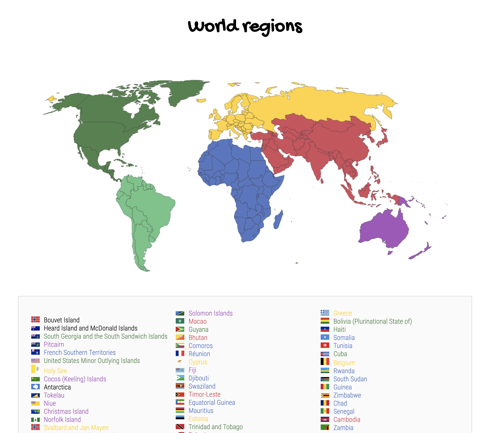

# Opdrachtbeschrijving

## Inleiding
Jouw Country Information App was een grote hit bij Constantijn, dus hij heeft gevraagd of je hem wil
uitbreiden met wat extra functionaliteit!

Je gaat dit doen met behulp van de REST Counties API. De documentatie over de verschillende endpoints
kun je [hier](https://restcountries.eu/#api-endpoints-all) vinden. 

## Voor je begint
1. Je mag verder werken in jouw bestaande Country Information App
2. Schrijf voor alle onderstaande opdrachten eerst **stap voor stap de psuedo-code uit**. 
Check bij de pseudo-antwoorden of je geen stappen overgeslagen hebt. Begin dan pas met programmeren.

## Plan de campagne
1. Maak een nieuwe HTML-pagina aan en link daar naartoe vanaf de home-pagina. Maak ook een nieuw JavaScript 
bestand aan en link die aan de nieuwe pagina. Koppel ook het bestaande CSS bestand hieraan.
2. Maak een functie die alle landen ophaalt en sorteert op grootte van de populatie, van laag naar hoog.
3. Zorg ervoor dat er een lijst met land-namen en de bijbehorende vlag in de DOM wordt geplaatst. Gebruik 
hierbij destructuring om de properties aan te spreken.
4. Plaats de landkaart `world_map.png` (te vinden in de `assets map`) bovenaan de pagina. 
5. De land-namen moeten worden weergegeven in een kleur die overeenkomt met het continent waar het land in ligt.
Maak hier een aparte functie voor. Een land ligt altijd in één van de volgende vijf contintenten, 
maar een uitzondering kan voorkomen: 
    * `Africa`: blauw
    * `Americas`: groen
    * `Asia`: rood
    * `Europe`: geel
    * `Oceania`: paars

_Tip:_ gebruik de Color Picker extensie om erachter te komen welke kleuren er op de afbeelding staan.

6. **Bonus:** Zet een event listener op elk land, zodat als de gebruiker op dat land klikt, de populatie eronder tevoorschijn komt. 
Zorg er ook voor dat als de gebruiker op een land klikt waarbij deze informatie al zichtbaar is, de informatie weer verdwijnt.
_Tip_: je hebt een unieke ID nodig voor elk tekst-element met populatie-informatie

7. **Bonus:** Zorg ervoor dat de styling aansluit bij de styling op de home-pagina
